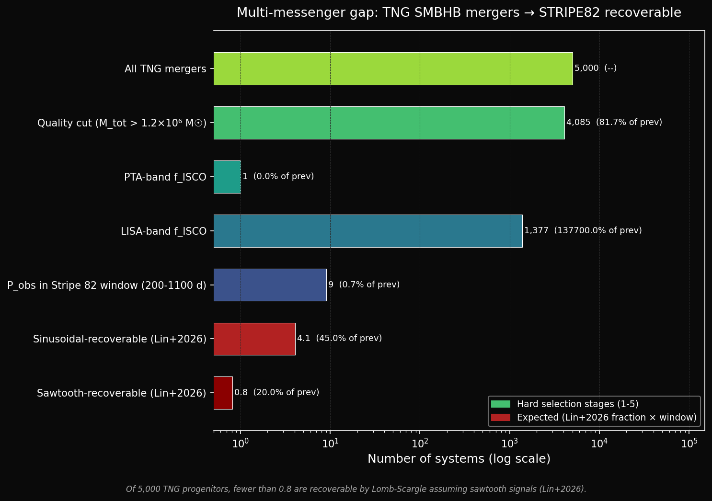

# Stripe 82 SMBHB Search

A pipeline for searching for supermassive black hole binary (SMBHB) candidates in the SDSS Stripe 82 quasar dataset using optical periodicity analysis and machine learning. Built as part of exploring the methodology behind multi-messenger searches for SMBHBs, relevant to projects like [MMMonsters](https://www.ia.forth.gr/).

---

## Portfolio context

This repo is one piece of a three-part project: simulated progenitor populations, predicted GW and EM signals from those progenitors, and a search for those signals in real survey data.

| Repo | Question it answers | Role |
|------|---------------------|------|
| [tng-smbhb-population](https://github.com/WizardEternal/tng-smbhb-population) | What does the progenitor population look like? | IllustrisTNG BH merger catalog, GW band classification, EM recovery funnel |
| [smbhb-inspiral](https://github.com/WizardEternal/smbhb-inspiral) | What do their GW and EM signatures look like? | Post-Newtonian inspiral simulator, detector sensitivity curves, EM detectability lookup |
| **Stripe82-SMBHB-search** (this repo) | Can we actually find them in real data? | DRW-based periodicity search and ML classification in SDSS Stripe 82 |

tng-smbhb-population tells you what the progenitor population looks like. smbhb-inspiral tells you what their GW and EM signatures look like. This repo takes that and goes looking for them in real data.

---

## Theoretical context: the multi-messenger gap



Starting from about 5,000 synthetic TNG-like merger events, the funnel drops by orders of magnitude at each selection step: quality cuts, LISA-band ISCO classification, period falling inside the Stripe 82 survey window (200-1100 days), and finally Lomb-Scargle recoverability. What is left at the bottom is a handful of sinusoidal candidates, and close to nothing if the signals are sawtooth-shaped.

The last step is where this pipeline lives. Lin, Charisi & Haiman 2026 (ApJ 997, 316) found that Lomb-Scargle recovers only about 9% of sawtooth-shaped SMBHB signals under PTF-like cadence, compared to about 45% for sinusoidal signals. Hydrodynamical simulations of circumbinary disks suggest the sawtooth morphology is the more physically realistic one, so the standard LS period search probably misses most real SMBHBs. That is part of why the Isolation Forest branch here exists, as a first step toward something more shape-agnostic. See smbhb-inspiral for the per-system GW and EM framing, and tng-smbhb-population for the catalog-level funnel.

---

## What is this actually doing?

Quasars vary in brightness over time in a random-looking way that is well described by a stochastic process called a Damped Random Walk (DRW). If a quasar hosts two supermassive black holes orbiting each other (an SMBHB), you would expect to see some periodic signal on top of that random variability, caused by things like the orbital motion, Doppler boosting, or the dynamics of the gas around the binary.

The problem is that random noise, if you stare at it long enough, will occasionally look periodic just by chance. This is especially bad for DRW-type red noise which has more power at long timescales and can easily fool a naive period search. So the main challenge here is not finding periodic signals, it is figuring out which ones are real.

The dataset is the MacLeod et al. Stripe 82 catalog: 9,258 spectroscopically confirmed quasars with optical light curves spanning roughly 10 years, from the SDSS. Observations happen in yearly seasons of about 3 months with nightly cadence, so there are large gaps of about 9 months between seasons every year. This makes period finding harder than it sounds.

One consequence of the seasonal gaps is a structured spectral window function — the LS periodogram of a constant signal sampled at the actual observing times has strong peaks at 365 days and harmonics (182.5 d, 121.7 d) purely from the sampling pattern. These are masked before reporting candidates, and the spectral window is shown explicitly as a diagnostic plot.

---

## Pipeline overview

| Script | What it does |
|--------|-------------|
| `01_download_data.py` | Downloads and extracts the raw data (~30 MB) |
| `02_eda.py` | Basic exploration of the light curves and the quasar population |
| `03_variability.py` | Computes structure functions and compares them to the DRW model |
| `04_periodicity.py` | Runs the Lomb-Scargle period search with proper DRW-based significance |
| `05_ml.py` | Three ML approaches for classifying periodic vs stochastic objects |
| `06_crossmatch.py` | Cross-matches candidates against Graham+2015; follows up on novel detections |

---

## The significance problem

Most published searches assess how significant a Lomb-Scargle peak is by comparing it against white noise. Quasar variability is not white noise, it is red noise, and using the wrong null model means your false alarm probabilities are way off. Here, for each candidate, we simulate 1,000 DRW light curves for that specific object (sampled at exactly the same times as the real data, using its fitted DRW parameters) and use the distribution of peak powers from those simulations as the significance threshold. A detection has to beat the 99th or 99.9th percentile of that distribution to count. At 1,000 simulations the 99th percentile is well-constrained; the 99.9th percentile has higher variance (roughly 1 event expected above threshold per run) and should be treated with more caution.

Two other things that matter a lot: the yearly seasonal gaps create fake peaks in the periodogram at 365 days and its harmonics, so those period ranges are masked out. And any claimed period has to fit at least 3 full cycles within the data baseline, otherwise it is not really constrained.

---

## Results

**Variability:** After subtracting the photometric noise floor from the structure function (SF^2_intrinsic = mean(dm^2) - mean(sigma_i^2 + sigma_j^2)), the population median SF sits systematically below the DRW model prediction across most lags. The deficit is most severe at lags of 100-300 days where the seasonal gaps leave very few observation pairs, but persists at shorter lags too. This is partly expected: the DRW is known to overpredict variability at short timescales for many quasars. The SF excess metric and MC significance thresholds therefore carry a systematic uncertainty from the null model itself.

**Period search:** Searching 8,896 objects over a period grid of 200-1100 days, we find 44 candidates significant at the 99% DRW level and 10 at 99.9%. Candidates mostly cluster around periods of 300-500 days (observer frame). At the sample median redshift of z≈1.7, these correspond to rest-frame orbital periods of roughly 110-185 days. Testing 200 objects at 99% significance implies ~2 expected false positives by chance, so finding 44 indicates a genuine population-level excess rather than noise fluctuations.

**ML:** Three separate approaches were used on purpose to deal with a circularity problem. If you train a classifier whose labels come from the LS peak power and then include LS peak power as a feature, the classifier just learns to replicate what you already computed (ROC-AUC 0.996, but meaningless). The more interesting result is the RF trained without any LS-derived features at all, which reaches ROC-AUC 0.816 using only light curve shape and variability statistics. A caveat: this AUC measures how well these features predict *high LS peak power*, not verified periodicity — features like excess variance and kurtosis correlate with variability amplitude, which raises LS power even for stochastic objects. Still, the result shows a non-trivial signal in the photometric properties that warrants further investigation. Kurtosis, skewness, and excess variance are the leading features. The unsupervised Isolation Forest (trained on the same no-LS feature set, so fully independent) adds a third ranking.

No objects were identified as novel candidates (high-scoring in both the LS-free RF and Isolation Forest while falling below the formal LS threshold) after applying honest cross-validated scores and running the IsoForest on the no-LS feature set. This is a methodologically cleaner result than earlier iterations that suffered from data leakage.

**Crossmatch:** Zero matches with Graham+2015, but this is not surprising. Only 2 of their 111 objects even fall in the Stripe 82 footprint to begin with. More importantly, many candidates from that era have since been shown not to persist when observed over longer baselines, which is a known issue with LS-based searches on short datasets.

---

## A known limitation worth mentioning

Lomb-Scargle looks for sinusoidal signals. Recent hydrodynamical simulations of circumbinary accretion disks (Lin, Charisi & Haiman 2026) suggest that real SMBHB light curves are more sawtooth-shaped, and LS only recovers those at about 1-9% efficiency. This means most real SMBHBs would be missed by this pipeline regardless of significance thresholds, which motivates the Isolation Forest approach as a first step toward something more shape-agnostic.

---

## Requirements

```bash
pip install numpy pandas matplotlib astropy scikit-learn scipy astroquery
```

Python 3.9+.

## Running it

```bash
python 01_download_data.py   # ~1 min
python 02_eda.py             # ~3 min
python 03_variability.py     # ~10 min
python 04_periodicity.py     # ~90 min (1000 MC sims per candidate)
python 05_ml.py              # ~15 min
python 06_crossmatch.py      # ~2 min
```

Plots go to `plots/`. Intermediate results (CSVs) go to `data/`.

---

## References

- MacLeod et al. 2010, ApJ 721, 1014  (DRW σ√(2τ) convention used for simulated null light curves)
- MacLeod et al. 2012, ApJ 753, 106
- Charisi et al. 2016, MNRAS 463, 2145
- Graham et al. 2015, MNRAS 453, 1562
- Vaughan et al. 2016, MNRAS 461, 3145
- Lin, Charisi & Haiman 2026, ApJ 997, 316
